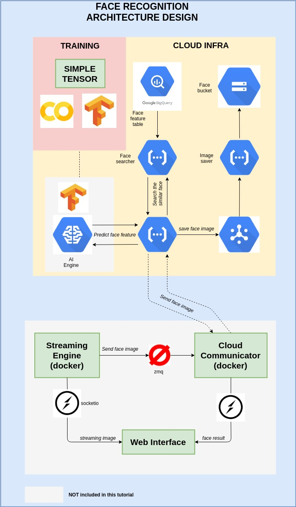

# Note
## What will we do ... ?
building this one ....  

## Packages Requirement
### Cloud
- Cloud function
- Bigquery
- GCS
- google ML-engine

### Training
- colab

### Others
- simple-tensor (`pip3 install simple-tensor`) [more info: pypi link](https://pypi.org/project/simple-tensor/)
- Tensorfow-gpu (1.1.3.1 or 1.14.0)
- dlib
- opencv
- numpy
- request
- flask
- gunicorn
- fask-cors
- postman 