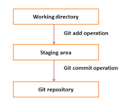

## Introduction To Git (Repository) 
### What is Git ...?
Git is a concept of version control or project management in the scope of software engineering. There are some choices for git, GitHub, bitbucket, or gitlab. Git allows developers to track the changes history of the code, give a version, determining the release and stable version, and collaborate with other developers.

Git has three main stages, Working directory, staging area, and remote directory, or repository. The working directory is a project in the developer's local computer. Developers move the project to the staging area by `git commit`, then push to the repository by `git push`. 

The example of pushing a file from local to the remote repository:
- add target file: `git add <filename>`
- move it to the staging area: `git commit -m <the message, ex:BUG fixing in ....>` 
- push to the remote repository: `git push origin <brach name>`

### Git Branch
Branch allows developers to edit their codes without disturbing each other. example:

- checking the current branch: `git status`
- create a new branch (if needed): `git branch <branch name>`
- chockout to the new branch: `git checkout <branch name>`

After developing some features, developers usually combine their codes. This step called `merge`. 

### Git Merge
Merge is an activity of combining some source-code in different branches.
- checkout to the master: `git checkout master`
- pull the master: `git pull origin master`
- merge branch : `git merge <branch name>`
- push the project: `git push origin master1`

#### Git Version
Every a new stable veature released, developer can make a `tag`.
- see the tag list: `git tag`
- create tag : `git tag v0.1`
- tag the current repository: `git push origin v0.1` 

### Others
- cancelling commit or add : `git reset --hard`